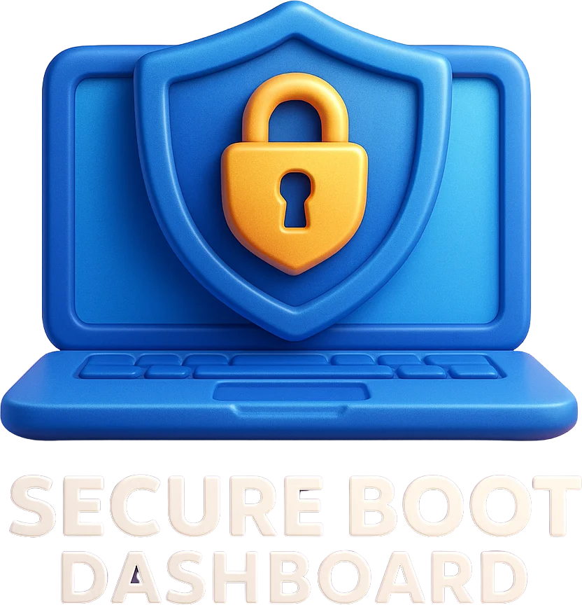

# ?? Secure Boot Certificate Dashboard

## La Soluzione Enterprise per la Gestione dei Certificati UEFI e la Preparazione a Windows 11

---

<p align="center">
  
</p>

<p align="center">
  <strong>Monitora • Analizza • Automatizza • Proteggi</strong>
</p>

---

## ?? Executive Summary

**Secure Boot Certificate Dashboard** è una soluzione enterprise completa per il monitoraggio e la gestione centralizzata dei certificati UEFI Secure Boot su flotte di dispositivi Windows.

Con l'avvicinarsi della **scadenza dei certificati UEFI CA 2023** e i requisiti di **Windows 11 24H2/25H2**, le organizzazioni devono garantire che tutti i dispositivi siano pronti per l'aggiornamento dei certificati di sicurezza del firmware.

### ?? Il Problema

| Sfida | Impatto |
|-------|---------|
| **Scadenza Certificati UEFI** | Dispositivi non più avviabili dopo la scadenza |
| **Migrazione Windows 11** | Blocco upgrade senza certificati aggiornati |
| **Visibilità Zero** | Nessun tool nativo per monitorare lo stato certificati |
| **Gestione Manuale** | Impossibile scalare su migliaia di dispositivi |
| **Compliance** | Rischio di non conformità alle policy di sicurezza |

### ? La Soluzione

**Secure Boot Certificate Dashboard** fornisce:

- ?? **Dashboard Real-Time** - Visibilità immediata su tutti i dispositivi
- ?? **Inventory Automatico** - Raccolta dati certificati senza intervento utente
- ?? **Deployment Remoto** - Aggiornamento certificati centralizzato
- ?? **Compliance Reporting** - Report per audit e governance
- ?? **Alerting Proattivo** - Notifiche su certificati in scadenza

---

## ??? Architettura della Soluzione

```
???????????????????????????????????????????????????????????????????????????????
?                           SECURE BOOT DASHBOARD                              ?
?                                                                              ?
?  ???????????????    ???????????????    ???????????????    ???????????????  ?
?  ?   Client    ?    ?    API      ?    ?  Dashboard  ?    ?  Database   ?  ?
?  ?   Agent     ????>?   Server    ?<????    Web UI   ?<????  SQL Server ?  ?
?  ? (Windows)   ?    ?  (REST)     ?    ?  (Browser)  ?    ?             ?  ?
?  ???????????????    ???????????????    ???????????????    ???????????????  ?
?                                                                              ?
?        ?                    ?                                                ?
?  ???????????????    ???????????????                                         ?
?  ?   Azure     ?    ?   SignalR   ?                                         ?
?  ?   Queue     ????>?   Hub       ? ? Real-time updates                     ?
?  ? (Optional)  ?    ?             ?                                         ?
?  ???????????????    ???????????????                                         ?
???????????????????????????????????????????????????????????????????????????????
```

### Componenti Principali

| Componente | Descrizione | Tecnologia |
|------------|-------------|------------|
| **Client Agent** | Agente leggero installato su ogni PC | .NET 10, Windows Service |
| **API Server** | Backend REST per raccolta dati e comandi | ASP.NET Core, Entity Framework |
| **Dashboard Web** | Interfaccia di gestione centralizzata | Razor Pages, Bootstrap 5 |
| **Database** | Storage persistente per inventory e storico | SQL Server / Azure SQL |
| **Azure Queue** | Buffer messaggi per alta disponibilità | Azure Storage Queue (opzionale) |

---

## ? Funzionalità Chiave

### 1. ?? Dashboard Centralizzata

**Visione completa del parco dispositivi in tempo reale**

- **Metriche Istantanee**: Totale dispositivi, deployati, pending, errori
- **Compliance %**: Percentuale dispositivi conformi ai requisiti
- **Trend Temporali**: Grafico evoluzione deployment nel tempo
- **Filtri Avanzati**: Per OS, manufacturer, fleet, stato deployment


### 2. ?? Inventory Certificati

**Raccolta automatica dello stato Secure Boot**

| Dato Raccolto | Descrizione |
|---------------|-------------|
| **Stato Secure Boot** | Enabled/Disabled |
| **Certificati UEFI** | Lista completa con scadenze |
| **Windows UEFI CA 2023** | Presenza del nuovo certificato |
| **Capability Code** | Supporto hardware all'update |
| **Firmware Info** | Versione, manufacturer, data rilascio |
| **OS Version** | Build Windows con compatibilità |

### 3. ?? Deployment Remoto

**Gestione centralizzata degli aggiornamenti certificati**

- **Comando Singolo**: Invia update a un device specifico
- **Batch Command**: Aggiorna gruppi di device contemporaneamente
- **Filtri Intelligenti**: 
  - Per Fleet ID
  - Per Manufacturer
  - Per Stato Deployment
  - Per Versione OS
- **Scheduling**: Programma esecuzione in finestre di manutenzione
- **Priorità**: Gestisci urgenza dei comandi

### 4. ?? Reporting & Analytics

**Report dettagliati per compliance e audit**

- **Readiness Report**: Dispositivi pronti vs non pronti
- **Certificate Expiration**: Alert su certificati in scadenza
- **Deployment Progress**: Stato avanzamento rollout
- **Error Analysis**: Analisi cause di fallimento
- **Export**: CSV, Excel, PDF per reportistica esterna

### 5. ?? Alerting & Notifiche

**Sistema proattivo di notifiche**

| Alert Type | Trigger | Azione |
|------------|---------|--------|
| **Critical** | Certificato scaduto | Email immediata |
| **Warning** | Certificato < 1 anno | Dashboard warning |
| **Info** | Nuovo dispositivo rilevato | Log evento |
| **Success** | Deployment completato | Aggiorna statistiche |

### 6. ?? Security Features

**Sicurezza enterprise-grade**

- **Mutual TLS**: Autenticazione certificato client-server
- **Windows Authentication**: Integrazione Active Directory
- **RBAC**: Controllo accessi basato su ruoli
- **Audit Log**: Tracciabilità completa delle operazioni
- **Encryption**: Dati crittografati at-rest e in-transit

---

## ?? Casi d'Uso

### ?? Scenario 1: Migrazione Windows 11

> *"Dobbiamo migrare 5.000 PC a Windows 11 24H2 ma non sappiamo quanti hanno i certificati aggiornati"*

**Soluzione**:
1. Deploy dell'agent su tutti i PC via SCCM/Intune
2. Dashboard mostra istantaneamente lo stato certificati
3. Identificazione dispositivi non ready
4. Batch update certificati sui dispositivi compatibili
5. Report finale per il management

**Risultato**: Migrazione completata in 2 settimane invece di 3 mesi

---

### ?? Scenario 2: Compliance Audit

> *"Il CISO richiede un report trimestrale sullo stato Secure Boot di tutti i dispositivi"*

**Soluzione**:
1. Dashboard filtra per stato Secure Boot
2. Export report in Excel con tutti i dettagli
3. Trend historico mostra evoluzione compliance
4. Alert automatici per deviazioni dalla policy

**Risultato**: Report generato in 5 minuti invece di 2 giorni

---

### ?? Scenario 3: Incident Response

> *"Abbiamo ricevuto un advisory su vulnerabilità nei certificati UEFI di un vendor specifico"*

**Soluzione**:
1. Filtra dashboard per Manufacturer = "VendorX"
2. Identifica tutti i dispositivi affetti
3. Batch command per forzare update certificati
4. Monitora progress in real-time
5. Report post-remediation

**Risultato**: Remediation completata in 4 ore invece di settimane

---

## ?? Benefici Quantificabili

### ?? Risparmio Tempo

| Attività | Prima | Dopo | Risparmio |
|----------|-------|------|-----------|
| Inventory manuale | 2 settimane | 30 minuti | **99%** |
| Report compliance | 2 giorni | 5 minuti | **99%** |
| Troubleshooting singolo PC | 1 ora | 2 minuti | **97%** |
| Deployment 1000 device | 1 mese | 1 giorno | **97%** |

### ?? ROI Stimato

| Voce | Costo/Risparmio |
|------|-----------------|
| **Licenza annuale** | €X per device |
| **Tempo IT risparmiato** | 200+ ore/anno |
| **Riduzione ticket helpdesk** | -40% |
| **Downtime evitato** | €Y per incidente |
| **ROI primo anno** | **300-500%** |

### ??? Risk Reduction

- ? **Eliminato**: Rischio device non avviabili per certificati scaduti
- ? **Eliminato**: Blocco upgrade Windows 11 per incompatibilità
- ? **Garantito**: 100% visibilità su stato certificati fleet
- ? **Garantito**: Compliance continua con policy di sicurezza

---

## ??? Requisiti Tecnici

### Server (API + Dashboard)

| Requisito | Minimo | Raccomandato |
|-----------|--------|--------------|
| **OS** | Windows Server 2019 | Windows Server 2022 |
| **CPU** | 4 core | 8 core |
| **RAM** | 8 GB | 16 GB |
| **Storage** | 50 GB SSD | 100 GB SSD |
| **.NET Runtime** | .NET 10 | .NET 10 |

### Database

| Requisito | Minimo | Raccomandato |
|-----------|--------|--------------|
| **Engine** | SQL Server 2019 | SQL Server 2022 / Azure SQL |
| **Storage** | 10 GB | 50 GB |
| **Backup** | Daily | Continuous |

### Client Agent

| Requisito | Valore |
|-----------|--------|
| **OS** | Windows 10 22H2+ / Windows 11 |
| **CPU** | Qualsiasi x64 |
| **RAM** | 50 MB durante esecuzione |
| **Storage** | 100 MB |
| **Network** | Outbound HTTPS (443) |
| **Privileges** | SYSTEM (via Task Scheduler) |

### Network

| Flusso | Porta | Protocollo |
|--------|-------|------------|
| Client ? API | 443 / 5001 | HTTPS |
| Dashboard ? API | 443 / 5001 | HTTPS |
| API ? SQL | 1433 | TDS/TLS |
| API ? Azure Queue | 443 | HTTPS (opzionale) |

---

## ?? Deployment Options

### Option A: On-Premises

```
???????????????????????????????????????????
?           CORPORATE NETWORK              ?
?                                          ?
?  ??????????  ??????????  ?????????????? ?
?  ? Client ?  ?  API   ?  ? SQL Server ? ?
?  ? Agents ??>? Server ??>? (On-Prem)  ? ?
?  ??????????  ??????????  ?????????????? ?
?                                          ?
???????????????????????????????????????????
```

**Ideale per**: Organizzazioni con policy strict su data residency

### Option B: Hybrid (Raccomandato)

```
???????????????????????????????????????????
?           CORPORATE NETWORK              ?
?                                          ?
?  ??????????                              ?
?  ? Client ?                              ?
?  ? Agents ????????                       ?
?  ??????????      ?                       ?
?                  ?                       ?
????????????????????????????????????????????
                   ?
                   ?
???????????????????????????????????????????
?              AZURE CLOUD                 ?
?                                          ?
?  ??????????????  ??????????  ?????????? ?
?  ? Azure Queue??>? API on ??>?Azure   ? ?
?  ? (Buffer)   ?  ? App Svc?  ?SQL DB  ? ?
?  ??????????????  ??????????  ?????????? ?
?                                          ?
???????????????????????????????????????????
```

**Ideale per**: Organizzazioni con infrastruttura cloud Azure esistente

### Option C: Full Cloud

**Azure PaaS deployment** con:
- Azure App Service (API + Web)
- Azure SQL Database
- Azure Storage Queue
- Azure Application Insights

**Ideale per**: Organizzazioni cloud-first senza infrastruttura on-prem

---

## ?? Licensing & Pricing

### Modello Licensing

| Tier | Device | Funzionalità |
|------|--------|--------------|
| **Starter** | 1-100 | Dashboard, Inventory, Basic Reporting |
| **Professional** | 101-500 | + Commands, Batch Operations, API Access |
| **Enterprise** | 500+ | + Azure Integration, mTLS, Custom Branding |

### Incluso in Tutte le Licenze

- ? Aggiornamenti software inclusi
- ? Supporto tecnico via email
- ? Documentazione completa
- ? Script di deployment (SCCM, Intune, GPO)

### Add-On Opzionali

- ?? Supporto telefonico premium
- ?? Training on-site
- ?? Professional Services per deployment
- ?? Integrazioni custom (ServiceNow, SIEM, etc.)

---

## ??? Roadmap

### ? Disponibile Oggi (v1.14)

- Dashboard real-time con SignalR
- Inventory automatico certificati
- Command management (singolo e batch)
- Windows Version tracking
- Client auto-update
- Azure Queue integration
- Mutual TLS authentication

### ?? Prossime Release (H1 2025)

- ?? Report schedulati automatici
- ?? Email notifications
- ?? Integrazione Microsoft Defender for Endpoint
- ?? Mobile-responsive dashboard
- ?? Multi-tenant support

### ?? Futuro (H2 2025+)

- ?? AI-powered remediation suggestions
- ?? Predictive analytics
- ?? Microsoft Graph integration
- ?? Intune co-management

---

## ?? Supporto & Servizi

### Supporto Incluso

| Canale | Response Time |
|--------|---------------|
| Email | 24h business days |
| Knowledge Base | Self-service |
| Community Forum | Best-effort |

### Supporto Premium (Add-On)

| Canale | Response Time |
|--------|---------------|
| Email prioritario | 4h |
| Telefono | 1h |
| Accesso diretto a engineering | Next business day |

### Professional Services

- **Assessment**: Analisi infrastruttura e readiness
- **Deployment**: Installazione e configurazione guidata
- **Training**: Formazione team IT (1-2 giorni)
- **Custom Development**: Integrazioni specifiche

---

## ?? Contatti

### Per Informazioni Commerciali

?? **Email**: sales@yourcompany.com  
?? **Telefono**: +39 02 XXXX XXXX  
?? **Web**: https://yourcompany.com/secureboot-dashboard

### Per Supporto Tecnico

?? **Email**: support@yourcompany.com  
?? **Docs**: https://docs.yourcompany.com  
?? **Issues**: https://github.com/yourcompany/secureboot-dashboard/issues

### Demo

?? **Richiedi una Demo**: [Prenota qui](https://calendly.com/yourcompany/demo)

---

## ?? Appendici

### A. Certificazioni & Compliance

- ? Compatible with Windows Hardware Quality Labs (WHQL)
- ? Tested on UEFI 2.5+ firmware
- ? GDPR-ready (data residency configurabile)
- ? SOC 2 Type II (in progress)

### B. Vendor Compatibility

| Vendor | Testato | Note |
|--------|---------|------|
| Dell | ? | Tutti i modelli business |
| HP | ? | ProBook, EliteBook, ZBook |
| Lenovo | ? | ThinkPad, ThinkCentre |
| Microsoft | ? | Surface Pro, Surface Laptop |
| VMware | ? | ESXi VMs con Secure Boot |
| Hyper-V | ? | Gen 2 VMs |

### C. Integration Matrix

| Sistema | Metodo | Status |
|---------|--------|--------|
| SCCM/MECM | Script deployment | ? Disponibile |
| Intune | Win32 App | ? Disponibile |
| Group Policy | Startup script | ? Disponibile |
| ServiceNow | REST API | ?? Roadmap |
| Splunk | Syslog forward | ?? Roadmap |

---

<p align="center">
  <strong>© 2025 - Secure Boot Certificate Dashboard</strong><br>
  <em>Proteggi il tuo firmware. Prepara il futuro.</em>
</p>

---

**Documento Versione**: 1.0  
**Data**: Dicembre 2024  
**Classificazione**: Commerciale - Pubblico
